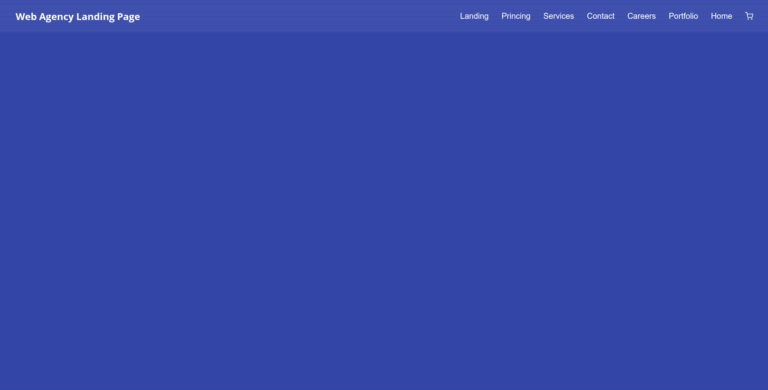

# A Responsive Top Menu Bar

## Content

- [Introduction](#introduction)
- [Preview](#preview)
- [History Record](#history-record)
- [How to clone](#how-to-clone)

## Introduction

A top menu bar for web and mobile devices. In this template, I learned about making a custom React component to be used on different pages.

The "Header Component" can be used in all the pages of the application. Loading, reloading or resizing the page the responsive top menu bar is shown.

Everything is made using:

- Nodejs
- React with TypeScript
- Styled-Components

## Preview



## History Record

- 09/28/2020

  - I still want to do:
    1. A custom Sign in component;
    2. A custom Register component;
    3.  Show the pages for authenticated users;
    4. A mobile version using React Native.

## How to Clone

```shell
git clone https://github.com/tuf-code/practice-layouts.git
cd <cloned folder>/web-agency/web
yarn start
```
